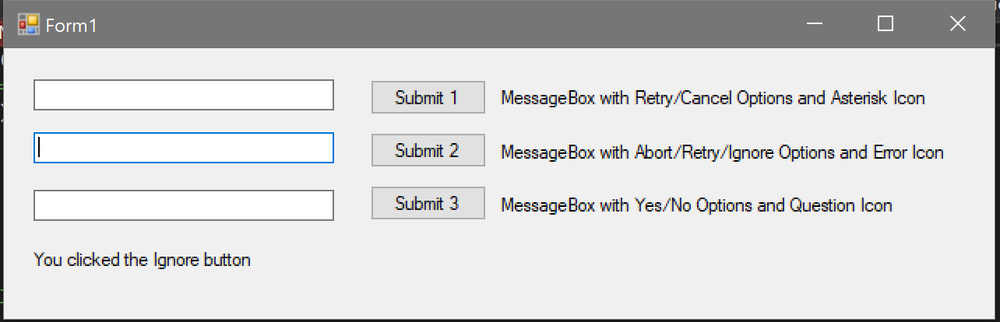

# Assignment 1 #

## First Part of assignment 1 (Program 1) ##

Create a Windows based program that allows the user to do the following:

1. Type a message in a textbox that will be displayed in a Message Box.
2. Display a given type of Message Box, based on the user’s selection.
3. Display what button the user selected on the Message Box.

Your form should have 3 textboxes that the user types a message into, and buttons next to each textbox that when clicked will display a different type of Message Box.  Next to each button there should be a label describing what will happen when the button is clicked.  Each button should display a Message Box that has different MessageBoxButtons on it.  Also, each Message Box should have different MessageBoxIcons on it.  The result of each Message Box should also be displayed on the form.  So, for instance if a Message Box with an “OK” button is displayed, when the “OK” button is clicked, the form should show that the button “OK” was clicked.



## Second Part of assignment 1 (Program 2) ##

Create a console based program that allows the user to enter two numbers and then prints the results of addition, subtraction, multiplication, division, and the remainder of the two numbers.  Then the program prints whether the first number is less than the second number, then prints whether the first number is greater than the second number, then prints whether the first number equals the second number.  For this assignment, you do not have to validate user input.  For example, if the user enters the letter “A” the program will crash.  In later assignments, you will be required to validate input, but for this assignment you do not.  However, if you want to practice I suggest you first finish the assignment, then go back and try to add in user validation.

Here is a sample output of the program:

```output
Please enter the first number: 10
Please enter the second number: 3

10 + 3 = 13
10 - 3 = 7
10 * 3 = 30
10 / 3 = 3
10 % 3 = 1

10 is not less than 3
10 is greater than 3
10 does not equal 3
```

