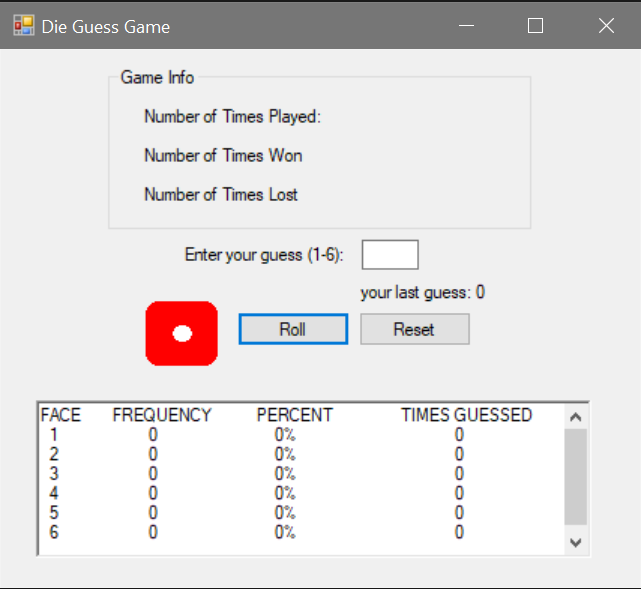

# Assignment 2 #

Create a Windows based program that allows the user to guess what the value of a rolled 6-sided dice will be. The program will display to the user how many times they have played and how many times they have guessed right or wrong. The program will also keep track of the frequency and percentage that each number was rolled, and the number of times the user guessed that number. The program will also have a reset button that returns the game to its initial state. When the roll button is pressed the dice image should randomly change a couple of times to simulate it rolling. This can be done with a for loop and calling the Thread.Sleep() method in the System.Threading namespace. You will also need to refresh the image. Make sure to check for valid input from the user. Only values of 1 through 6 should be allowed to be entered by the user. Only 1 digit should be allowed to be entered in the textbox, by setting the MaxLength property of the textbox. If an invalid value is entered, a label containing an error message should be displayed next to the user’s guess textbox. For help with the dice roll see example “Chapter 5 and 6 Example”.

**For WPF, to set a Gif an Image control:**

1. Create a folder called  "Images" in the project.
2. Right click on the folder, select  "add",  "existing item", then select your image.
3. Select the image, then in the properties window for  "Build Action", select  "Resource".
4. Set in your code:
MyImage.Source = new BitmapImage(new Uri(@ "Images/die1.gif", UriKind.Relative));