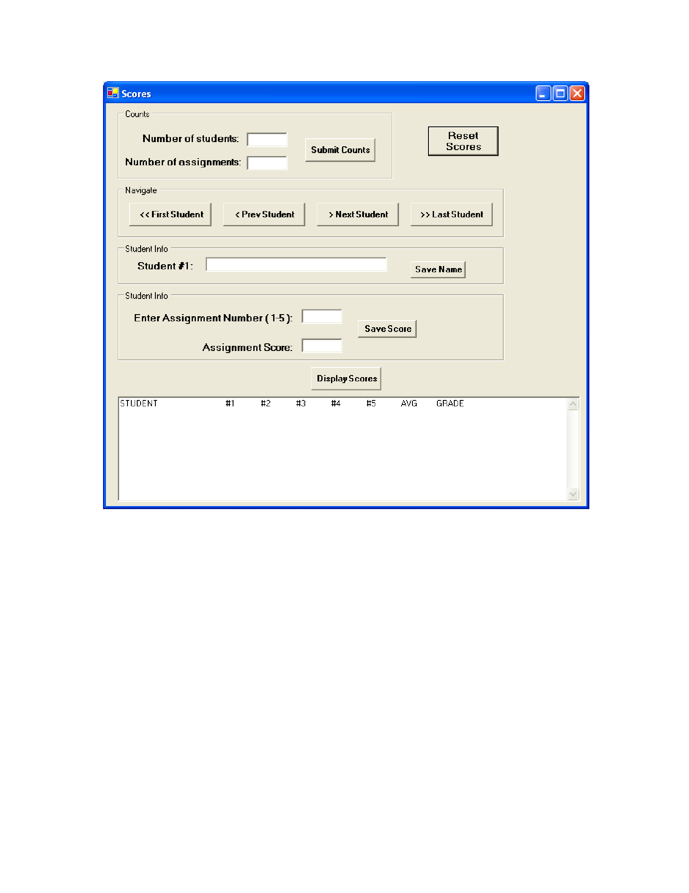

# Assignment 3 #

Create a Windows based program that inputs students’ assignment scores and displays them. The program must use arrays to store the student’s information (single dimensional array) and assignment scores (multi-dimensional array).
The program will give the user the ability to enter the number of students (max 10) and the number of assignments (max 99). These values must be validated and error labels given for invalid input. The students’ scores will be defaulted to zero, and the students’ names will be defaulted to “Student #1”, “Student #2”, etc. After the counts have been submitted the user will be allowed to navigate between the students. Each student’s name can be updated and saved by clicking the “Save Name” button. The assignment scores can be updated and saved by entering the assignment number, the assignment score, then clicking the “Save Score” button. The label “Enter Assignment Number (1-X)” should not be hard coded, it should display the correct number of assignments.

At any time after the counts have been submitted the “Display Scores” button may be clicked. This button will display the students, their grades, their average grade, and their letter grade. Use the syllabus for this class to determine the letter grade. Don’t worry too much about if the columns line up perfectly based on how long names are, just get it close. Formatting can be done using tab and new line constants in your string.

At any time, the “Reset Scores” button may be clicked, which will reset the program to its original state of entering the counts.

