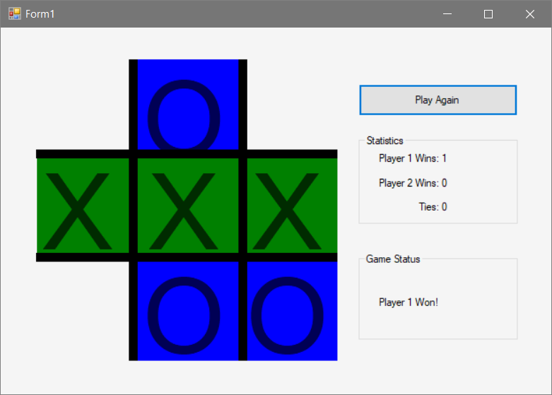
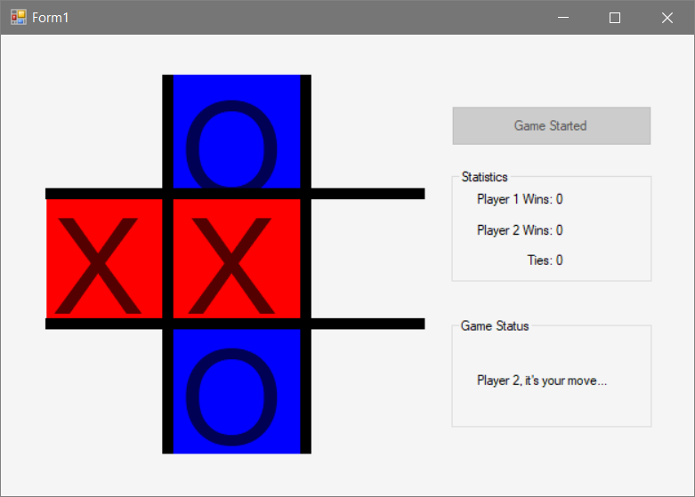

# Assignment 4 #

Create a Tic-Tac-Toe game that can be played by two players. The form will consist of a Tic-Tac-Toe board in which the users' click on to choose their space. As the game is being played the Game Status section will tell whose turn it is. When someone wins or there is a tie, a message will be displayed in the Game status section telling the users the status. When someone wins the game the winning move needs to be indicated. There also needs to be a section that keeps track of the number of wins for each player, and the number of ties. When the game is finished, the user may click the "Start Game" button to start a new game. This program will consist of the main form and at least one class that will define the rules of the game. This class will have an array that is passed in through a property that represents the game board. The class will then have methods within it that determines if someone won, if there is a tie, or if neither has occurred yet. **Make sure all business logic is in a separate class and not behind the UI.**

Experiment with color and styles. If you are using WPF you have a lot more options than windows forms.

EXTRA CREDIT (10 Points) - Create a computer player that can be played against. The computer player will need to be smart enough to make a winning move or to block a winning move.
