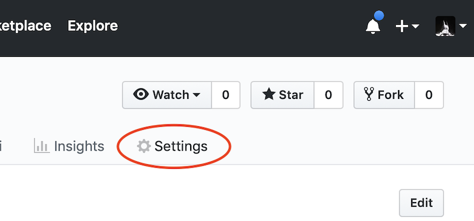
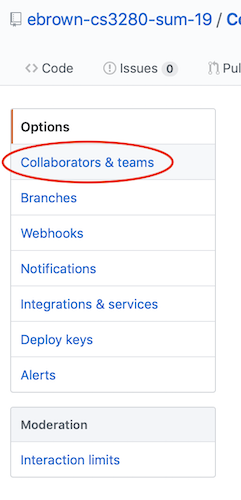
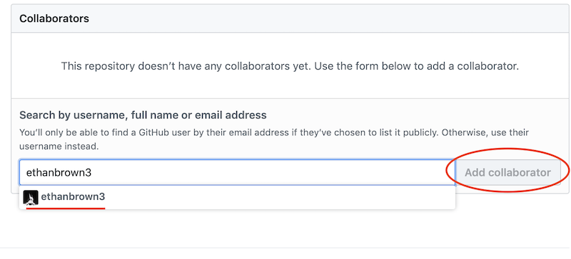

# Assignment Instructions #

CS 3280 assignment requirement files. I will be adding instructions and any necessary files for assignments to this repo throughout the semester.

## Links to assignment instructions ##

0. [Git Activity](GitActivity.md)
1. [Assignment 1 Instructions](Assignment1.md)
2. [Assignment 2 Instructions](Assignment2.md)
3. [Assignment 3 Instructions](Assignment3.md)

## Turning In Assignments ##

All assignments will be turned in using github.

Workflow for turning in assignments:

1. Create a new **private repo** in github for the assignment. You can name it whatever you like but I recommend something like: `cs3280Assignment1`
2. Add `ethanbrown3` as a collaborator to that repo
   1. 
   2. 
   3. 
3. I recommend adding a [c# .gitignore file](https://www.gitignore.io/api/csharp)
4. Make frequent commits as you work on the assignment (this helps me track your progress and offer feedback)
5. When the assignment is completed, copy the link to the repo and submit it for the assignment submission

> **WARNING:** Please don't forget to make your repo private. If it is not private I won't grade it. We'll talk about public repos and open source projects for the final project.

## Rubric ##

* Program Correctness - 50%
  * Program always works correctly according the specifications
  * All files needed for running the code are in the git repo
* Readability - 25%
  * Well organized code paths
  *  Consistent formatting
  * Descriptive naming (variables, methods, classes, etc)
  * No unnecessary commenting that clutters the code (keep comments to public facing pieces of code, if you are having to comment something inside a code block... it's too complicated or you naming isn't descriptive enough)
* Code Elegance - 15%
  * Minimal to no hardcoding
  * Loops are used responsibly (don't nest too much)
  * If statements are clean (no pyramids of doom)
  * switches are used responsibly
  * Nothing too "clever"
  * etc.
* Documentation - 10%
  * Public methods are commented well
  * Classes and custom types are commented well
